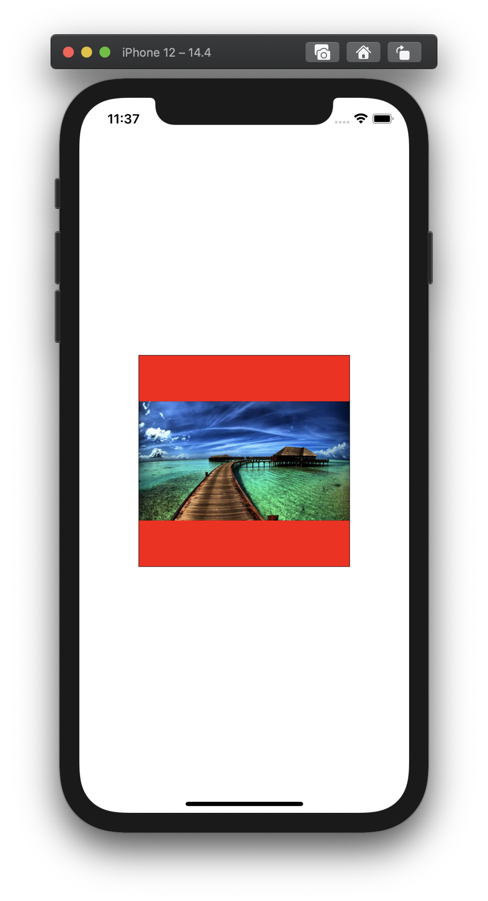
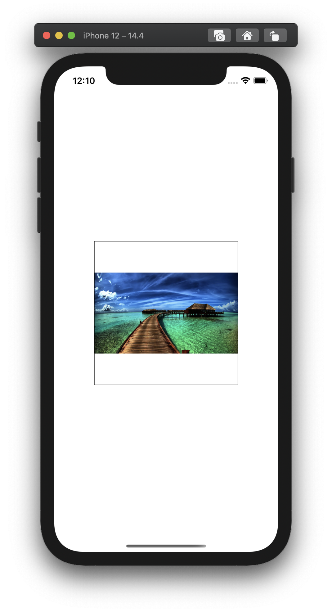

# Example project for how to make react-native load third party libraries from a custom path

This example project was made to go with the [following gist](https://gist.github.com/Pirsanth/cf201ee3b6cbae5acd504f5b03b20b29).

Please run `npm install&&cd ios&&pod install` after cloning the repo as `node_modules/` and `/ios/Pods/` is included in .gitignore. `./modifiedRNLibraries` contains the modified version of the react-native-image-with-progress-bar library. The original version of the library can be found under the `node_modules` directory. After cloning and running `npm install&&cd ios&&pod install`, when we run `react-native run-android` or `react-native run-ios` the native code and JS code for the react-native-image-with-progress-bar library will be loaded from the `./modifiedRNLibraries/react-native-image-with-progress-bar` directory. To find out how to use the original version of the library, please keep reading.



The modified library (pictured above) has a red background for the image whereas the ordinary library (from node_modules,pictured below) has no such background. Note that these results occur when there is no backgroundColor in the style prop. 



To use the **native code** (more in the gist/medium article) of the normal version of the library (without a red background) comment out `react-native.config.js` so that a custom root for the react-native-image-with-progress-bar library is not specified. Perhaps like below:

```javascript
const path = require('path');
const relativePathToLibraryFromRNProjectRoot = "./modifiedRNLibraries/react-native-image-with-progress-bar";

module.exports = {
    dependencies: {
        // "react-native-image-with-progress-bar": {
        //     root: path.resolve(__dirname, relativePathToLibraryFromRNProjectRoot)
        // }
    },
    project: { ios: {}, android: {} },
    assets: [],
    commands: [],
    platforms: {}
  };
  
```

We have to run `pod install` in the ios directory before running `react-native run-ios` again if we have changed the specified root of the library in `react-native.config.js`.